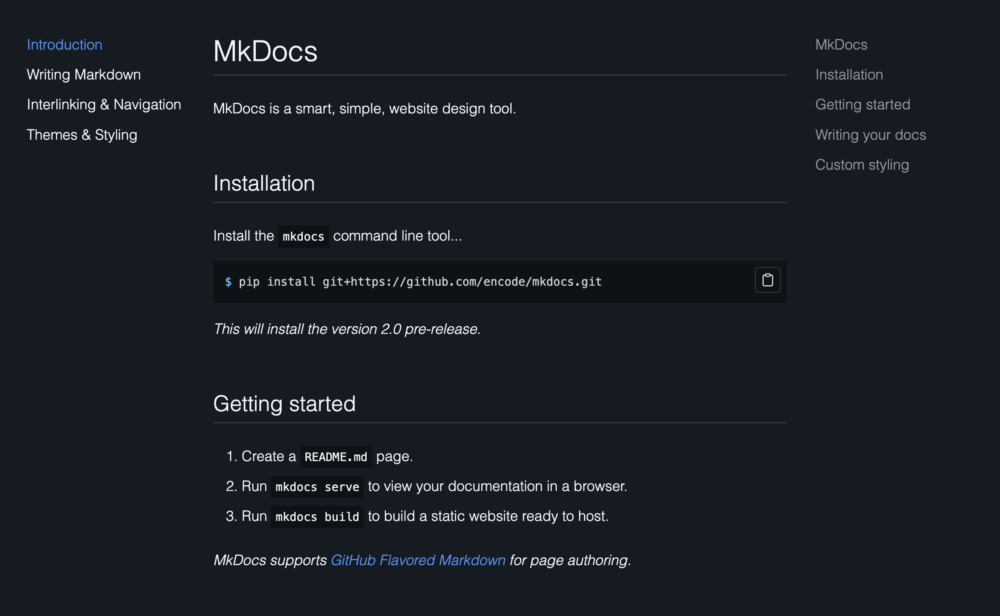
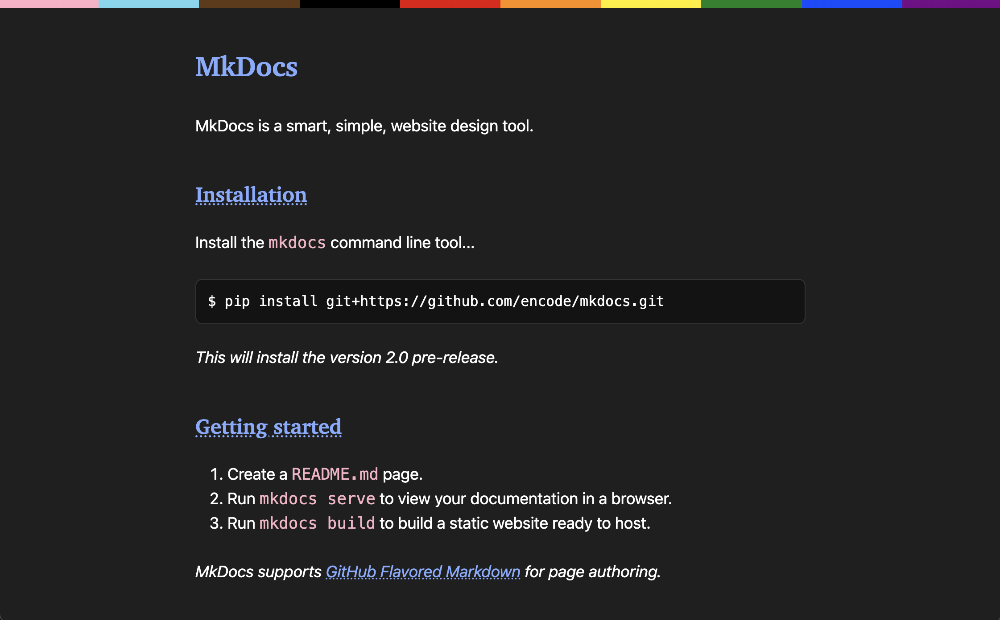

# MkDocs

MkDocs is a smart, simple, website design tool.



## Installation

Install the `mkdocs` command line tool...

```shell
$ pip install git+https://github.com/encode/mkdocs.git
```

*This will install the version 2.0 pre-release.*

## Getting started

1. Create a `README.md` page.
2. Run `mkdocs serve` to view your documentation in a browser.
3. Run `mkdocs build` to build a static website ready to host.

*MkDocs supports [GitHub Flavored Markdown](writing.md) for page authoring.*

## Writing your docs

1. Create additional markdown pages.
2. Use [markdown interlinking](navigation.md#interlinking) between pages.
3. Create a `mkdocs.toml` file to define [the site navigation](navigation.md#navigation) and other configuration.
4. Move your markdown pages into a `docs` directory, and update the config.

An example `mkdocs.toml`...

```toml
[mkdocs]
nav = [
    {path="README.md", title="Introduction"},
    {path="CREDITS.md", title="Credits"},
]

[loaders]
theme = "pkg://mkdocs/default"
docs = "dir://docs"

[context]
title = "Documentation"
favicon = "📘"
```

*Use either [`README.md` or `index.md`](navigation.md#url-structure) for the homepage.*

## Custom styling

Styling adaptations can be kept simple, such as customising the colour scheme, or more comprehensive, such as creating an entirely new theme.

1. Configure the base theme for your project.
2. Modify [the HTML templating](styling.md#templates) to customise the layout.
3. Override or add [CSS and JavaScript](styling.md#statics) static assets.

Take a look at the [default theme](https://github.com/lovelydinosaur/mkdocs-theme) and the [kelp theme](https://github.com/lovelydinosaur/kelp-theme) for examples of getting started with theming.



*The MkDocs documentation, served with the Kelp theme.*
